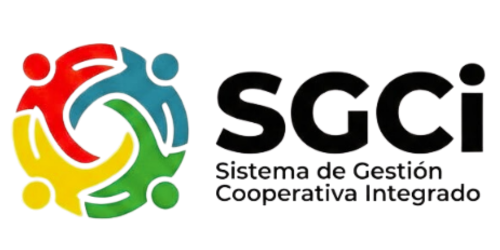

# Sistema de Gestión Cooperativa Integrado (SGCi)



## Resumen

El Sistema de Gestión Cooperativa Integrado (SGCi) es una plataforma robusta y centralizada diseñada para optimizar las operaciones esenciales de una cooperativa. Desde la gestión detallada de socios hasta el manejo contable y financiero, el SGCi asegura transparencia, eficiencia y cumplimiento normativo, proporcionando una herramienta integral para el crecimiento y la administración eficaz de tu cooperativa.

## Características Principales

El sistema está organizado en módulos clave para cubrir todas las necesidades operativas:

*   **Módulo de Gestión de Socios (MGS):** Centraliza la información y las interacciones con los miembros. Incluye registro, actualización, control de aportaciones y seguimiento de participación.
*   **Módulo de Crédito y Préstamos (MCP):** Gestiona el ciclo de vida completo de los productos de crédito, desde la originación hasta el seguimiento de la cartera y las garantías.
*   **Módulo de Ahorro y Captaciones (MAC):** Administración de cuentas de ahorro a la vista, a plazo fijo y especiales, con registro de transacciones, cálculo de intereses y conciliación bancaria.
*   **Módulo de Servicios Varios (MSV):** Gestión de actividades adicionales como eventos, inventario y documentación.
*   **Módulo Contable y Financiero (MCF):** Sistema contable integrado que automatiza registros, permite cierres contables, genera libros contables y reportes financieros (Balance General, Estado de Resultados, etc.).
*   **Módulo de Cumplimiento y Auditoría (MCA):** Asegura el cumplimiento regulatorio mediante trazabilidad de operaciones, reportes regulatorios y herramientas de prevención de lavado de activos.
*   **Módulo de Seguridad:** Gestión granular de usuarios, roles y permisos para controlar el acceso a todas las funcionalidades del sistema.

## Tecnologías Utilizadas

*   **Framework Principal:** Laravel 12
*   **Interfaz de Usuario:** Livewire (starter kit) para una experiencia dinámica y reactiva.
*   **Base de Datos:** MySQL
*   **Gestión de Roles y Permisos:** `spatie/laravel-permission`

## Instalación

Sigue estos pasos para poner en marcha el proyecto:

1.  **Clonar el repositorio:**
    ```bash
    git clone [URL_DEL_REPOSITORIO] sgci
    cd sgci
    ```
2.  **Configurar el archivo `.env`:**
    Copia el archivo `.env.example` a `.env` y configura tus credenciales de base de datos MySQL.
    ```bash
    cp .env.example .env
    # Edita .env con tus credenciales de DB
    ```
3.  **Instalar dependencias de Composer:**
    ```bash
    composer install
    ```
4.  **Generar la clave de la aplicación:**
    ```bash
    php artisan key:generate
    ```
5.  **Ejecutar migraciones y seeders:**
    Esto creará las tablas de la base de datos y poblará los datos iniciales, incluyendo el usuario administrador y los roles/permisos.
    ```bash
    php artisan migrate --seed
    ```
6.  **Instalar dependencias de NPM y compilar assets:**
    ```bash
    npm install
    npm run build
    ```

## Uso

Para iniciar el servidor de desarrollo y acceder a la aplicación:

```bash
php artisan serve
```

Abre tu navegador y visita `http://127.0.0.1:8000` (o el puerto que Artisan te indique).

### Credenciales del Usuario Administrador

Para acceder al panel de administración, utiliza las siguientes credenciales:

*   **Correo:** `RosarioEdwinAC@gmail.com`
*   **Contraseña:** `PPsae5938`

Este usuario tiene el rol de `admin` y posee todos los permisos para gestionar el sistema.

## Contribución

Si deseas contribuir a este proyecto, por favor, sigue las directrices de contribución y presenta tus cambios a través de solicitudes de extracción (Pull Requests).

## Licencia

El SGCi es software de código abierto licenciado bajo la [Licencia MIT](LICENSE.md).
